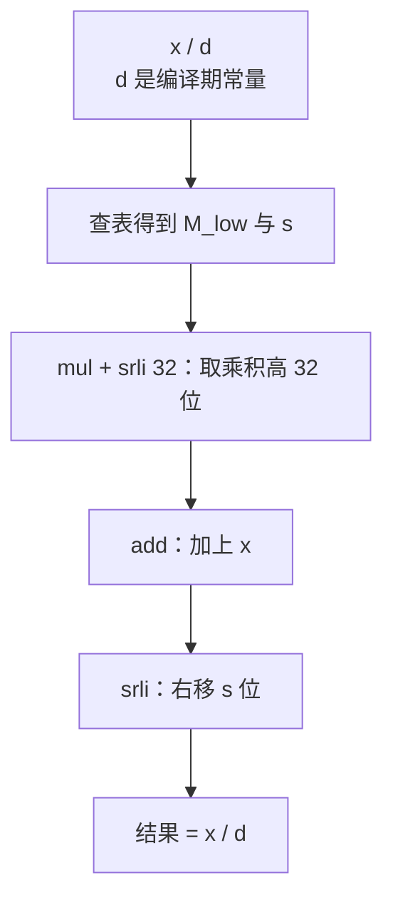
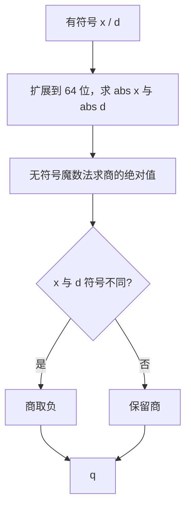

# 强度削减：乘法换移位与魔数法除法

强度削减（strength reduction）指用代价更低的等价运算替换代价较高的运算。在循环中收益最大，因为循环体的开销随迭代次数线性放大。

RISC-V 上整数运算的代价差别很大：

| 运算 | 典型延迟（周期） | 说明 |
| --- | --- | --- |
| `add` / `sub` / `slli` 等 | 1 | 最低 |
| `mul` | 3 ~ 5 | 流水线乘法器 |
| `div` / `rem` | 20 ~ 40，且延迟不固定 | 逐位试商，代价最高 |

因此强度削减有两个方向：把乘法换成移位与加法，把除法换成乘法。后者即魔数法（magic number division）。

:::tip[与目标代码优化的分工]
[目标代码层的强度削减](asm-strength-reduction)只做局部、可直接验证等价的替换（例如乘 2 的幂换成移位）；需要数学推导的"除法换乘法"放在 IR 层，也就是本页。
:::

## 一、必要性：除法与取余的代价

一个常见的 ToyC 片段：

```c
int digit_sum(int n) {
    int sum = 0;
    while (n > 0) {
        sum = sum + n % 10;
        n = n / 10;
    }
    return sum;
}
```

循环体内各有一次除法和取余。它们的延迟取决于处理器实现；当它们占据热点时，常量除法的替换值得测试。

在目标代码层，`div` 已经是一条硬件指令，数学推导通常应在 IR 层完成：对无符号数或已证明非负的分子、且除数为编译期常量时，除法可以改写为“乘一个魔数再右移若干位”；有符号情况需要额外的符号修正。

## 二、乘法换移位与加法

在 ToyC 采用 32 位补码回绕语义的前提下，乘法可以按位分解为移位与加减，下列替换保持结果一致：

| 原式 | 替换为 | 说明 |
| --- | --- | --- |
| `x * 2^k` | `x << k` | 2 的幂直接换移位，后端也实现这条 |
| `x * 3` | `(x << 1) + x` | 拆成 2 + 1 |
| `x * 7` | `(x << 3) − x` | 用减法比 `(x<<2)+(x<<1)+x` 更短 |

更一般的常量 `c` 可按二进制分解：把 `c` 中为 1 的位对应的移位结果相加（如 `x * 5` 写成 `(x << 2) + x`、`x * 10` 写成 `(x << 3) + (x << 1)`）；若“减去最高位”的写法更短，则优先用减法，例如 `x * 22 = (x << 4) + (x << 2) + (x << 1)`，三条指令替换一条 `mul`。

## 三、魔数法：把除以常量变成乘法

### 3.1 最简单的特例

无符号数除以 `2^k` 就是逻辑右移 `k` 位：

```text
x / 2^k  ≡  x >> k        （x 为无符号数，>> 为逻辑右移）
```

对非负数而言，丢掉低 `k` 位就是整除，不存在误差。需要处理的是任意除数（3、7、10 等）和有符号的负数。

### 3.2 用定点小数表示 1/d

目标是把 `x / d` 改写为乘法。注意 `1/d` 可以表示为

```text
1/d ≈ M / 2^(32+s)      （M 为整数，s 为选定的移位量）
```

对无符号 32 位 `x`（或已经证明非负的有符号 `x`），有

```text
x / d ≈ (x * M) >> (32 + s)
```

只要 `M` 足够精确，这个近似式向下取整的结果就与无符号整数除法完全相等。取

```text
s = ceil(log2 d)                       // 保证精度足够，同时尽量小
M = floor(2^(32+s) / d) + 1            // 向上取整，用于消除截断误差
```

即可对全部 32 位无符号 `x` 精确成立；有符号除法必须使用 3.4 节的符号修正，不能直接套用这组指令。

这里假设 `d > 1` 且不是 2 的幂。此时 `1 < 2^s / d < 2`，`M` 落在 `(2^32, 2^33)`，只需 33 位。把它拆成 `2^32 + M_low`，便可避免直接计算 65 位乘积。2 的幂单独用移位处理，除零保持语言原有行为。

### 3.3 RISC-V 上的指令形式

把 `M = 2^32 + M_low` 代入：

```text
(x * M) >> 32 = (x * 2^32 + x * M_low) >> 32
             = x + ((x * M_low) >> 32)
             = x + high32(x * M_low)
```

这里的 `high32` 是数学操作：取 32×32 乘积的高 32 位。RV64 的 `mulhu` 取的是 64×64 乘积的高 64 位，不能直接代入。对零扩展到 64 位的两个 32 位操作数，应先 `mul`，再逻辑右移 32 位。[RISC-V M 扩展规范](https://docs.riscv.org/reference/isa/v20240411/unpriv/m-st-ext.html)明确区分了这些位宽。再右移 `s` 位：

```text
q = (x * M) >> (32 + s) = (x + high32(x * M_low)) >> s
```

对应 RV64 指令序列（`a0` 已零扩展，`M_low` 按无符号 32 位数加载）：

```asm
  li    t0, M_low        # 魔数低 32 位
  mul   t1, a0, t0       # 完整的 32×32 -> 64 位乘积
  srli  t1, t1, 32       # 取高 32 位
  add   t1, t1, a0       # 中间和最多 33 位，不能用 addw
  srli  a0, t1, s        # a0 = 无符号 x / d
```

加载常量之外有四条运算指令，是否比 `divuw` 更快应在目标环境中测量。


```mermaid
flowchart TB
  A["x / d<br/>d 是编译期常量"] --> B["查表得到 M_low 与 s"]
  B --> C["mul + srli 32：取乘积高 32 位"]
  C --> D["add：加上 x"]
  D --> E["srli：右移 s 位"]
  E --> F["结果 = x / d"]
```

### 3.4 有符号数

有符号除法按向零截断（`-7 / 2 = -3`），不能直接套用无符号公式。下面的修正先对 `|d|` 求商，再根据被除数和除数的符号调整结果；`INT_MIN / -1` 还要按语言约定单独处理。

除数为 2 的幂时，加一个偏置再算术右移即可：

```text
t = x >> 31              // 在 32 位 IR 中，x 为负时 t = -1，否则 t = 0
t = t & (d - 1)          // 取下界偏置
q = (x + t) >> k         // 算术右移 k 位（d = 2^k）
```

以 `x = -7, d = 2` 为例：`t = -1`，`t & 1 = 1`，`(-7 + 1) >> 1 = -3`，与 `-7 / 2` 一致；而直接计算 `-7 >> 1` 得到 `-4`，相差 1。这就是除法不能直接换成移位的原因。

除数为一般常量时，先把 `x` 符号扩展到 64 位，再取绝对值，使 `INT_MIN` 的绝对值也能表示；套用无符号魔数法后，按被除数与除数的符号异或取负：

```text
x64  = sign_extend_i32_to_i64(x)
sign = x64 >> 63                 // x < 0 时为 -1，否则为 0
ax   = (x64 ^ sign) - sign       // 64 位绝对值，范围 0..2^31
dabs = absWide(d)
q    = unsigned_magic(ax, dabs)  // 3.3 节的高 32 位乘积序列
if d < 0 then sign = ~sign end if // 商符号 = x 与 d 的符号异或
q    = (q ^ sign) - sign         // 按商符号取负
```


```mermaid
flowchart TB
  A["有符号 x / d"] --> B["扩展到 64 位，求 abs x 与 abs d"]
  B --> C["无符号魔数法求商的绝对值"]
  C --> D{"x 与 d 符号不同?"}
  D -->|是| E[商取负]
  D -->|否| F[保留商]
  E --> Q[q]
  F --> Q
```

### 3.5 取余

`%` 的值由商决定，算出商之后只需两条指令：

```text
r = x − q * d        // mul + sub
```

`x % 10` 这类"取十进制末位"的写法在程序中很常见，魔数法把它从 `rem` 降为乘加。

### 3.6 常用除数的魔数表（32 位）

| 除数 `d` | 移位 `s` | 魔数 `M` | `M_low`（十六进制） |
| --- | --- | --- | --- |
| 3 | 2 | 5726623062 | `0x55555556` |
| 6 | 3 | 5726623062 | `0x55555556` |
| 7 | 3 | 4908534053 | `0x24924925` |
| 10 | 4 | 6871947674 | `0x9999999A` |
| 100 | 7 | 5497558139 | `0x47AE147B` |
| 1000 | 10 | 4398046512 | `0x0624DD30` |

:::note[表中数值的来源]
以 `d = 10` 为例：`s = ceil(log2 10) = 4`，`M = floor(2^36 / 10) + 1 = 6871947674`，`M_low = M − 2^32 = 2576980378`（`0x9999999A`）。按 3.3 节在 RV64 中计算高 32 位乘积、加 `x`、再右移 4 位，得到无符号商；验证方法见第八节。
:::

## 四、算法

**算法 · 除法强度削减（Strength Reduction for Division）**

**输入（Input）：** 函数 IR，其中包含 `sdiv` / `udiv` / `srem` / `urem` 指令。
**输出（Output）：** 除数为编译期常量的除法与取余被替换为"乘魔数 + 移位 + 加减"的 IR。

```
 1: strengthReduceDivision(func):
 2:     for each instruction I in func do
 3:         if I.opcode ∉ {sdiv, udiv, srem, urem} then continue; end if
 4:         if not isConstant(I.divisor) then continue; end if      // 除数必须是编译期常量
 5:         d = I.divisor.value;
 6:         if d == 0 then continue; end if                           // 保留原来的除零语义
 7:         if isPowerOfTwo(absWide(d)) then                          // 特例 1：含 ±1
 8:             rewriteDivisionOrRemainderByShift(I, d);              // 保留符号与溢出约定
 9:             continue;
10:         end if
11:         magnitude = I is signed ? absWide(d) : unsignedValue(d);
12:         // 后面的查表、乘法和修正在扩展位宽中执行
13:
14:         s  = ceilLog2(magnitude);
15:         M  = floor(2^(32+s) / magnitude) + 1;                     // 编译期用足够宽的整数计算
16:         Ml = M − 2^32;                                            // 只保留低 32 位
17:         if I is unsigned then
18:             q = emitUnsignedMagic(zext64(I.numerator), Ml, s);
19:         else
20:             q = emitSignedMagic(sext64(I.numerator), d, Ml, s);   // 取绝对值 + 商符号修正
21:         end if
22:         if I.opcode is a division then
23:             replaceAllUsesWith(I, trunc32(q));
24:         else                                                      // 取余：r = x − q * d
25:             r = emitSub(extend64(I.numerator), emitMul(q, d));    // r = x − q*d
26:             replaceAllUsesWith(I, trunc32(r));
27:         end if
28:         remove(I);
29:     end for
30:     return func;
```

"乘魔数取商"这一步可以封装为：

```
 1: emitUnsignedMagic(x, Ml, s):                        // q = (x * M) >> (32 + s)
 2:     hi = lshr(mul_i64(x, Ml), 32);                  // x 与 Ml 都为零扩展的 32 位值
 3:     t  = add_i64(hi, x);                            // 33 位中间和保存在 i64
 4:     return srli(t, s);                              // 再逻辑右移 s 位
```

:::tip[实现建议]
`M_low` 与 `s` 只与除数有关，可用一张编译期常量表（`d → (M_low, s)`）缓存，避免对同一除数重复推导；除数超出表的范围时再现场计算。这也解释了为什么强度削减通常排在常量传播之后：除数越"确定"，能替换的除法越多。
:::

## 五、完整示例

```c
int f(int x) {
    return x / 10;
}
```

基线汇编：

```asm
    li   t0, 10
    divw a0, a0, t0       # ToyC int 的有符号 32 位除法
```

强度削减后（假设入口 `a0` 已按 ABI 符号扩展）：

```asm
    srai t0, a0, 63       # t0 = x < 0 ? -1 : 0
    xor  t1, a0, t0
    sub  t1, t1, t0       # t1 = |x|
    li   t2, 0x9999999A   # M_low（d = 10）
    mul  t3, t1, t2
    srli t3, t3, 32       # 高 32 位乘积
    add  t3, t3, t1       # 64 位加法，保留第 33 位
    srli t3, t3, 4        # t3 = |x| / 10
    xor  a0, t3, t0
    sub  a0, a0, t0       # 按原符号取负
```

若编译期能证明 `x >= 0`（例如支配当前块的分支已经排除负数），可省掉绝对值和符号修正。`n % 100` 只有在 `n >= 0` 时才能证明结果非负。

```asm
    li    t0, 0x9999999A
    mul   t1, a0, t0
    srli  t1, t1, 32
    add   t1, t1, a0
    srli  a0, t1, 4       # a0 = x / 10
```

## 六、优化效果

- 指令级：用乘法、移位和加减替换除法；指令数会增加，延迟与收益取决于具体处理器和 QEMU 运行方式，应以实测为准。
- 与常量传播配合：传播把除数变成常量，强度削减才能命中；替换后又产生新的常量与可折叠表达式，因此应放在迭代管线中反复执行。
- 与归纳变量配合：乘常量的线性表达式可改为派生归纳变量；整数商存在截断，不能直接当作固定步长的线性递推。
- 代价：指令条数增加会略微加大寄存器压力，对迭代次数极少的循环可能得不偿失，因此工业编译器通常只在循环内或能确认收益时启用。

## 七、正确性陷阱

| 陷阱 | 说明 |
| --- | --- |
| 除数是运行期变量 | 魔数法只对编译期常量除数成立，`x / y` 只能保留 `div` |
| 有符号按无符号处理 | 有符号除法向零截断，直接套用无符号公式会在负数上相差 1 |
| `d = -1` 与 `INT_MIN` | `INT_MIN / -1` 溢出（C 语言中为未定义行为，RISC-V `div` 返回 `INT_MIN`），取绝对值的写法在此处会溢出，必须特判 `d = ±1` |
| 取余的符号 | ToyC 与 C 一致：余数符号跟随被除数，必须用 `r = x − q * d` 反算，不能直接搬用无符号取余 |
| 位宽假设 | 本页公式针对 32 位 `int`（ToyC 的 `int` 为 32 位有符号）；扩展到 64 位时 `M`、`s` 与移位量都要按 64 位重新计算 |
| 移位指令语义 | 无符号商用逻辑右移；本页 RV64 符号修正用 `srai 63`，不能把高 32 位乘积误写成 RV64 `mulhu` |
| 溢出标志 | 若 IR 带有 `nsw` / `nuw` 标志，替换后需保证标志语义仍然成立 |

## 八、动手验证

魔数法的正确性适合用对拍验证，但也容易因为符号位处理不当出错，因此测试是必要的：

```bash
# 1. 检查优化后的汇编是否还残留除法
./compiler -asm -opt < test.c > after.s
grep -nE '\b(div|divw|rem|remw)\b' after.s     # 除数全是常量时应当没有输出

# 2. 对拍：优化前后分别链接运行，比较输出
./compiler -asm      < test.c > base.s
./compiler -asm -opt < test.c > opt.s
```

建议对有符号和无符号范围分别取样，包含 `0`、`±1`、`INT_MIN`、`INT_MAX`、`UINT_MAX`，以及除数倍数附近的值，逐个比较原商、余数与优化结果。抽样能发现实现错误，不能替代公式证明；表中参数应由公式计算，勿把抽样称为全范围验证。

下一步阅读：[函数内联](ir-inline)。前序知识：[常量传播](ir-cprop) 负责把除数变成常量，[循环不变代码外提](ir-licm) 决定这些除法是否需要留在循环中。
