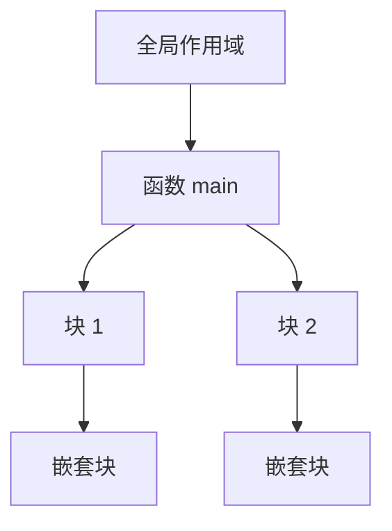

# 常见问题 FAQ

## 通用

### Q：可以用语言自带的库做词法分析吗？

可以，但必须能解释清楚它内部做了什么。实验报告需要补充说明该库所采用的
自动机模型与你的等价手工实现方案。

### Q：测试用例的输出格式必须逐字符一致吗？

行号、列号、字面量必须一致；空白与制表符的差异不计入错误。建议用
`diff -w` 做本地比对。

### Q：编译器崩溃算不算"错误输入处理失败"？

算。任何输入（包括非法输入）都不允许让程序异常终止。请为每个阶段设置
错误恢复路径。

## 实验一 · 词法分析

### Q：`a+++++b` 该怎么切分？

按最长匹配：`a` `++` `++` `+` `b`。虽然语法上非法，但词法阶段不做语义判断，
只需给出正确的记号序列，后续阶段再报错。

### Q：块注释未闭合怎么办？

报告错误 `unterminated comment` 并给出起始行号，然后终止词法分析
（或跳到文件末尾后终止）。

## 实验二 / 三 · 语法分析

### Q：递归下降遇到左递归就死循环？

需要消除左递归或改写为迭代形式。例如 `E -> E + T | T` 改写为：

```text
E  -> T E'
E' -> '+' T E' | ε
```

### Q：LL(1) 预测分析表有冲突怎么办？

说明该文法不是 LL(1)。处理方式二选一：
1. 改写文法（提取左因子、消除左递归）；
2. 改用 LR 分析（实验三）。

报告中必须说明冲突出现在哪两个产生式之间。

### Q：SLR(1) 有移进-归约冲突？

说明 FOLLOW 集区分能力不足，应升级到 LR(1) 或 LALR(1)，
并说明合并同心项目集后冲突是否被引入。

## 实验四 · 语义分析

### Q：符号表作用域怎么组织？

推荐使用**作用域栈 + 每层哈希表**：



查找时自内向外逐层搜索，退出块时弹出对应表。

### Q：变量未声明就使用，应该在哪个阶段报错？

语义分析阶段。词法与语法阶段不应涉及符号信息。

## 实验五 · 中间代码生成

### Q：为什么需要临时变量？

为了把复合表达式拆成"一个四元式只做一次运算"，便于后续优化和指令选择。

### Q：布尔表达式的短路求值怎么写？

用回填（backpatching）技术：先生成跳转指令占位，待目标确定后再填写标号。
参见 [第五部分](../labs/part5-ir-optimization) 中的回填示例。

## 实验六 · 代码优化

### Q：优化越多越好吗？

不是。优化必须在**保持语义等价**的前提下进行，且要考虑编译时间成本。
报告中需给出优化前后的指令数对比。

### Q：如何验证优化没有改变语义？

对同一组测试用例，比较优化前后程序的运行结果是否完全一致。

## 实验七 · 目标代码生成

### Q：寄存器不够用怎么办？

使用图着色或线性扫描做寄存器分配，溢出部分写入栈帧。
报告中需说明你选择的算法与溢出处理策略。

### Q：生成的汇编在本机跑不了？

请确认使用的是统一规定的 RISC-V64GC 工具链，并指定 `-march=rv64gc` 与
`-mabi=lp64d`。最终链接时还要加入 ToyC 运行时静态库 `libtoyc.a`，
否则 `getint` 或 `putint` 等外部符号会解析失败。

## 环境与提交

### Q：助教的一条命令构建失败了？

通常是缺少构建脚本或硬编码了绝对路径。请在干净环境中用
`git clone` 后重新验证一次，确保没有遗漏文件。

### Q：PR 被合并后还能改吗？

可以，用新的 commit 推送到同一分支，PR 会自动更新。
