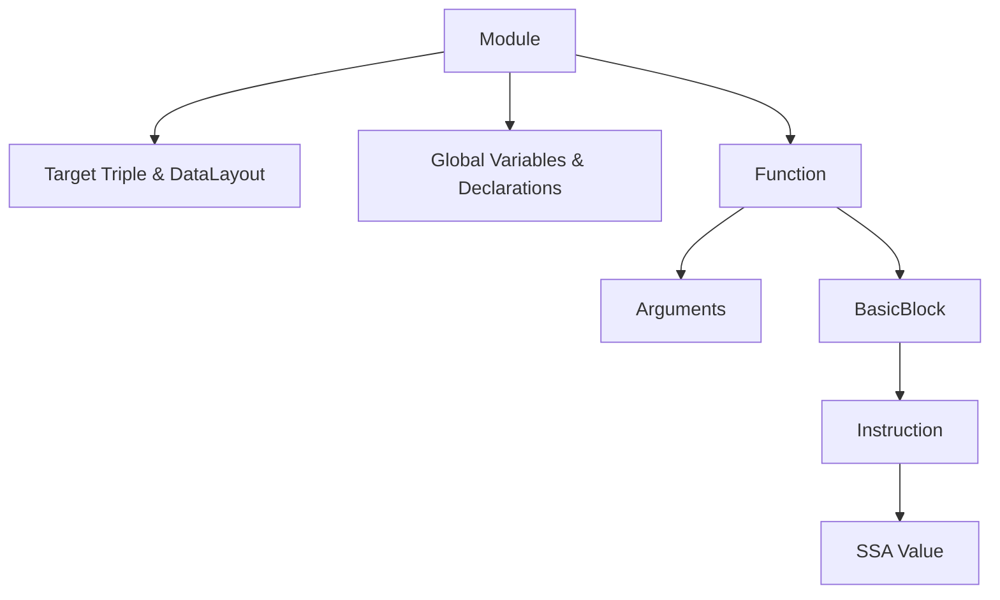
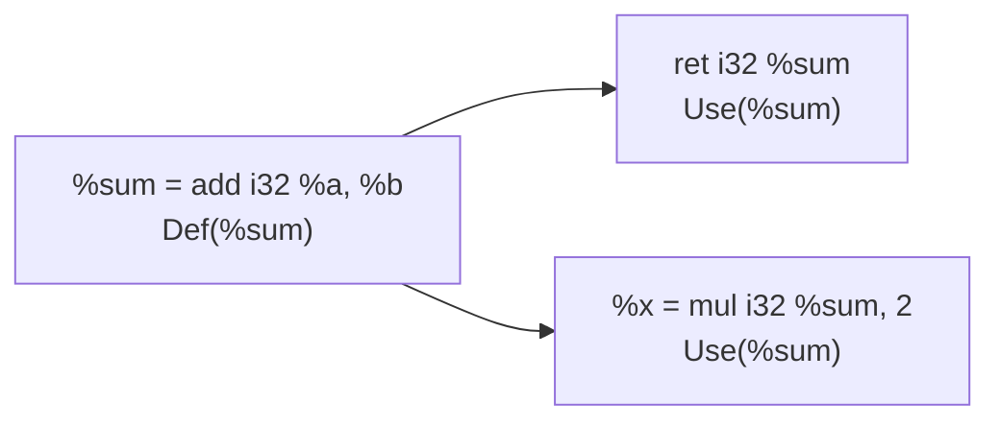
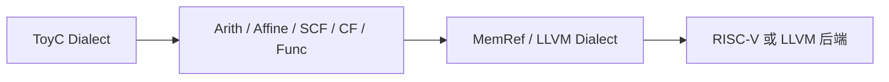
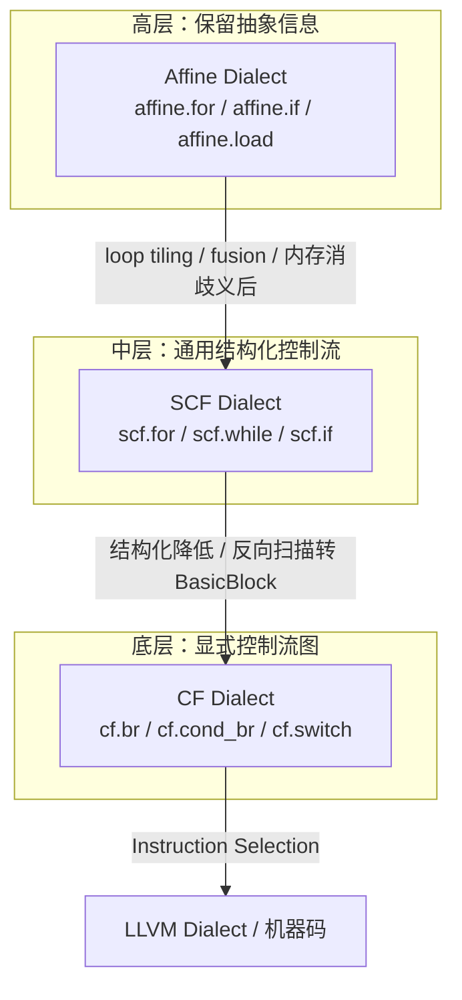

# LLVM IR 与 MLIR 参考

> **工程约束**：ToyC 编译器全程禁止引入任何第三方运行时库，包括 LLVM、MLIR 以及其他编译器基础设施。LLVM IR 与 MLIR 仅作为参考架构，用于理解 SSA 设计、`phi` 语义、多阶段 lowering 等思想。词法与语法分析阶段允许使用工具生成代码骨架（例如基于 Flex/Bison 的实现），但 IR 生成、优化、目标代码生成都必须自行完成。课程项目的 IR 实现推荐自定义三地址码。

第三部分的 IR 设计建议使用自定义三地址码，必要时可参考 LLVM IR 与 MLIR 的设计理念。本页用于在开始第三部分前建立共同概念。

## 一、LLVM IR 的结构

LLVM IR 是一种强类型 SSA 三地址码：每条指令最多一个算术结果，可以有 0 个或多个操作数；它同时是编译器内部表示和文本格式（`.ll`），用 `llvm-as` / `llvm-dis` 可以双向转换。

> LLVM IR 仅作为 ToyC IR 设计的参考架构，课程项目禁止集成 LLVM 库。学生应参考 LLVM IR 的 SSA 组织形式、`phi` 节点语义、内存模型（alloca/load/store）和 calling convention，自行决定三地址码的结构。

### 1.1 层级结构



- **Module**：一个编译单元，相当于一个 `.c` 文件翻译后的产物；包含目标三元组（`riscv64-unknown-elf`）、数据布局（指针宽度、对齐）、全局变量、外部函数声明、若干 Function。
- **Function**：包含参数列表、返回类型、若干 BasicBlock；可以带属性（如 `readonly`、`nounwind`）帮助优化器推断副作用。
- **BasicBlock**：以标签（如 `entry:`、`while.body:`、`while.end:`）开头，**单入口、多出口**，最后一条指令必须是 terminator（`br` / `cond_br` / `switch` / `ret` / `unreachable`）。
- **Instruction**：基本计算单元，结果用 `%name` 表示。
- **SSA Value**：每个 SSA 名称**在函数内只被定义一次**；控制流汇合处用 `phi` 选择来自不同前驱的值。

### 1.2 常用指令族

| 类别 | 关键指令 | 说明 |
|---|---|---|
| 算术 | `add / sub / mul / sdiv / srem` | 整数运算；`fadd / fmul` 等浮点 |
| 比较 | `icmp slt / sgt / eq` | 整数比较；`fcmp` 浮点 |
| 内存 | `alloca / load / store / getelementptr` | `alloca` 在栈上分配；`getelementptr`（GEP）只算地址，不访问内存 |
| 调用 | `call / invoke` | 调用约定由参数类型与属性决定 |
| 终止符 | `br / cond_br / switch / ret / unreachable` | 必须放在 BasicBlock 末尾 |
| SSA 汇合 | `phi` | 选前驱块传入的值 |
| 类型转换 | `trunc / zext / sext / bitcast / ptrtoint / inttoptr` | 影响后续优化合法性 |
| 选择 | `select i1 %c, i32 %a, i32 %b` | 等价于无分支的三目运算符 |

### 1.3 类型系统

LLVM IR 的类型影响 lowering 和优化合法性：

| 类型 | 例子 | 含义 |
|---|---|---|
| 整数 | `i1 / i32 / i64` | 任意宽度整数，`i1` 是布尔 |
| 浮点 | `float / double` | 与 C 一致 |
| 指针 | `ptr`（新版）/ `i8*` / `i32*` | opaque 指针（LLVM 14+）不携带元素类型 |
| 数组 | `[10 x i32]` | 定长数组，元素布局确定 |
| 结构 | `{ i32, float }` | 字面顺序的字段集合 |
| 函数 | `i32 (i32, i32)*` | 函数指针类型 |

举例：`getelementptr [10 x i32], ptr %arr, i64 0, i64 %i` 会算 `&arr[i]`，但不读内存；后续 `load i32, ptr %p` 才真正访问内存。这种"GEP 只算地址、load/store 才访问"的两阶段设计是 LLVM 内存模型的精髓，也是 mem2reg 等优化能工作的基础。

### 1.4 内存模型与 SSA 提升

LLVM IR 用 `alloca` 模拟"局部变量在栈上的位置"：

```llvm
define i32 @toy_max(i32 %a, i32 %b) {
entry:
  %x = alloca i32          ; 分配 4 字节栈空间
  %cond = icmp sgt i32 %a, %b
  br i1 %cond, label %then, label %else
then:
  store i32 %a, ptr %x
  br label %join
else:
  store i32 %b, ptr %x
  br label %join
join:
  %r = load i32, ptr %x
  ret i32 %r
}
```

这里 `alloca` + `store` + `load` 把变量 `x` 当成内存对象处理，控制流汇合时不需要 `phi`。代价是每次读 `x` 都要 `load`，每次写 `x` 都要 `store`，不利于优化。`mem2reg` pass 会：

1. 找到只被 `alloca/store/load` 使用的局部变量；
2. 在控制流汇合处插入 `phi`；
3. 删除 `store`，把 `load` 重写为 SSA 值直接使用。

优化后等价于：

```llvm
define i32 @toy_max(i32 %a, i32 %b) {
entry:
  %cond = icmp sgt i32 %a, %b
  br i1 %cond, label %then, label %else
then:
  br label %join
else:
  br label %join
join:
  %r = phi i32 [ %a, %then ], [ %b, %else ]
  ret i32 %r
}
```

实现建议：先输出 `alloca/load/store` 形式以保证正确性，再以显式优化提升到 SSA。课程项目不强制要求 mem2reg；但若不实现，提升阶段只能停留在内存模型，无法利用寄存器直接持有局部变量，目标程序运行速度会明显较慢。

### 1.5 典型 ToyC 程序完整示例

下面把 `int sum_abs(int *A, int n)`（求数组前 n 个元素的绝对值之和）翻译成 LLVM IR，涵盖循环、归纳变量 `phi`、内存加载、函数调用。

ToyC 源码：

```c
int abs(int x) { return x < 0 ? -x : x; }

int sum_abs(int *A, int n) {
  int s = 0;
  int i = 0;
  while (i < n) {
    s = s + abs(A[i]);
    i = i + 1;
  }
  return s;
}
```

LLVM IR（未优化）：

```llvm
define i32 @abs(i32 %x) {
entry:
  %cmp = icmp slt i32 %x, 0
  br i1 %cmp, label %neg, label %pos
neg:
  %r1 = sub i32 0, %x
  br label %end
pos:
  br label %end
end:
  %r = phi i32 [ %r1, %neg ], [ %x, %pos ]
  ret i32 %r
}

define i32 @sum_abs(ptr %A, i32 %n) {
entry:
  br label %loop.header
loop.header:                                     ; 循环条件
  %i = phi i32 [ 0, %entry ], [ %i.next, %loop.body ]
  %s = phi i32 [ 0, %entry ], [ %s.next, %loop.body ]
  %cond = icmp slt i32 %i, %n
  br i1 %cond, label %loop.body, label %loop.end
loop.body:                                       ; 循环体
  %idx = sext i32 %i to i64
  %elem.ptr = getelementptr i32, ptr %A, i64 %idx
  %elem = load i32, ptr %elem.ptr
  %val = call i32 @abs(i32 %elem)
  %s.next = add i32 %s, %val
  %i.next = add i32 %i, 1
  br label %loop.header
loop.end:
  ret i32 %s
}
```

要点：

- 归纳变量用 phi 表达：`%i` 和 `%s` 在 `loop.header` 既是循环入口定义（来自 `entry`）也是循环回边定义（来自 `loop.body`）；这是 LLVM IR 表达 `for`/`while` 循环的标准模式。
- `getelementptr` 不读内存：`%elem.ptr = getelementptr i32, ptr %A, i64 %idx` 只算地址；`load i32, ptr %elem.ptr` 才真正访问内存；中间可以插入别名分析而不影响正确性。
- `call` 隐含 calling convention：`@abs(i32 %elem)` 默认按 C 调用约定传参；返回 `i32` 放在 `a0`（RISC-V）或 `eax`（x86）；ToyC 编译器不需要手动处理，LLVM 后端会处理。
- `sext i32 %i to i64`：GEP 索引要求 64 位（与目标机器位宽一致），所以把 `i32` 提升为 `i64`。

### 1.6 LLVM IR 到 RISC-V 的端到端 lowering

把上面的 `sum_abs` 在 `opt -O2` 后交给 `llc --target=riscv64-unknown-elf`，得到的 RV64GC 汇编（简化）：

```asm
sum_abs:
        blez    a1, .LBB1_4
        li      a2, 0
        li      a3, 0
.LBB1_2:                                # 循环头
        slli    a4, a2, 2                # i * 4 (GEP 已折叠成偏移)
        add     a4, a0, a4
        lw      a5, 0(a4)                # load A[i]
        sext.w  a0, a5
        bge     a0, zero, .LBB1_3        # if x >= 0
        sub     a0, zero, a0
.LBB1_3:
        addw    a3, a3, a0
        addiw   a2, a2, 1
        blt     a2, a1, .LBB1_2          # if i < n 继续循环
        mv      a0, a3
        ret
.LBB1_4:
        li      a0, 0
        ret
```

可以观察到 LLVM 自动完成了：
- phi 消除：把两个 phi 的初值分别落到 `a2`（i）和 `a3`（s）的寄存器中。
- 归纳变量强度削减：`%i * 4` 折叠成 `slli a4, a2, 2`，因为数组步长已知。
- 循环外提：`abs` 调用未外提（因为结果依赖 `A[i]`），但 `n <= 0` 提前退出。
- 寄存器分配：`%i`、`%s`、参数 `A`、`n` 映射到 `a0~a4`。
- CFG 简化和汇编化：phi 节点被消除成直接寄存器传递；GEP 变成 `slli + add` 的指针算术。

### 1.7 LLVM IR 的优点与局限

优点

- 手写后端被省略：ToyC 只要产生 LLVM IR，立即获得 RV64GC / x86_64 / ARM64 后端以及 `-O0/-O1/-O2/-O3` 全部优化，学生不必自研寄存器分配与指令选择。
- mem2reg 把内存变量自动提升为 SSA：ToyC 编译器可以先输出 `alloca + store + load` 形式保证正确性，再开启优化得到高质量 SSA。
- 强类型便于调试：每个 SSA 值都有类型，`llvm-as` 编译出错时报错精确到行号和列号，方便学生定位。
- 与 GDB / 工具链衔接：`llvm -g` 编译后 `addr2line` 能直接对应到源码行。

局限

- 高层信息被过早丢失：`for (int i = 0; i < n; i++)` 在 lowering 后只剩 `phi + icmp + addi`；想写跨循环优化（fusion、tiling）已经无法直接从 IR 看出"这是循环"，必须重建 LoopInfo。
- 内存模型复杂：`load/store/getelementptr/atomic/ordering/volatile` 的语义细节多；初学者常误用 `volatile` 当 `atomic`，或者忘记 GEP 必须 64 位索引。
- API 体量：LLVM C++ API 有 20+ 万行；课程项目集成 LLVM 需要正确链接 `LLVMCore / LLVMSupport / LLVMTarget / LLVMRISCV` 等十几个库，且 ABI 跨版本不兼容。
- 与 MLIR 重复建设：LLVM 15+ 已开始用 MLIR 重建部分基础设施；如果课程选了 LLVM IR，未来想升级到 MLIR 几乎要重写 IR 生成层。

SSA（Static Single Assignment，静态单赋值）是一种 IR 组织形式：每个 SSA 名称在一个函数中只能被定义一次，但可以被多次使用。这里的“单次赋值”针对编译器内部的值，不是说源程序变量只能赋值一次。

例如 ToyC：

```c
x = a + 1;
x = x * 2;
```

在普通变量表示中，两次赋值都写入 `x`；在 SSA 中，每次赋值产生新版本：

```llvm
%x1 = add i32 %a, 1
%x2 = mul i32 %x1, 2
```

这样每个名称的定义位置唯一，Use-Def 链可以直接从 `%x2` 找到第二条指令，再从 `%x1` 找到第一条指令。SSA 的主要目的不是改变程序语义，而是让数据流关系显式化，便于优化器判断一个值来自哪里。

### 控制流汇合与 phi

如果同一个源变量在不同控制流路径被赋予不同值，单纯改名无法决定汇合处使用哪个版本。`phi` 根据“从哪条前驱边进入”选择值：

```c
if (cond) x = 1;
else      x = 2;
return x;
```

对应的 LLVM IR 结构是：

```llvm
br i1 %cond, label %then, label %else
then:
  br label %join
else:
  br label %join
join:
  %x = phi i32 [ 1, %then ], [ 2, %else ]
  ret i32 %x
```

`phi` 不是普通运行时函数调用；它表示在控制流分析中选择前驱块产生的值，最终降低到机器代码时通常会转换成适当的寄存器移动。

### 从内存变量到 SSA

初始 lowering 可以用地址形式保持实现简单：

```llvm
%x = alloca i32
store i32 1, ptr %x
%v = load i32, ptr %x
```

这种形式允许多个 `store`，所以变量的定义关系需要通过内存分析确定。`mem2reg` 会识别适合提升的局部变量，插入必要的 `phi`，再把 `load/store` 转成 SSA 值。课程实现可以先使用 `alloca/load/store` 生成正确 IR，再将 mem2reg 作为选做优化。

### SSA 的优点和代价

- 优点：每个值只有一个定义，常量传播、复制传播、死代码消除和 Use-Def 链实现更直接；
- 优点：控制流汇合处的不同来源由 `phi` 明确表示，减少隐式的变量版本推断；
- 代价：需要维护基本块前驱关系和 `phi` 参数；
- 代价：离开 SSA 生成 RISC-V 时，需要处理 `phi` 消除、并行复制和寄存器冲突。

## 二、Use-Def 链

Use-Def 链记录 IR 中每个值的定义位置和所有使用位置，是连接 SSA、数据流分析与优化的重要关系。

- **Def（Definition）**：产生一个值的指令或函数参数。例如 `%sum = add i32 %a, %b` 定义 `%sum`；
- **Use（Use）**：读取某个值的操作数位置。例如 `ret i32 %sum` 使用 `%sum`；
- **Use-Def 链**：从一次使用反向找到它对应的定义；
- **Def-Use 链**：从一次定义正向找到该值的全部使用。



在 SSA 形式下，普通 SSA 值只有一个定义，因此 Use-Def 链可以直接通过值的定义指针定位；多个控制流来源汇合时，由 `phi` 指令定义一个新值。内存变量经过 `alloca/load/store` 表示时，一个变量可能有多个 store 定义，需要借助内存到 SSA 的转换或到达定义分析建立对应关系。

### 建议数据结构

```text
Value {
  name
  type
  definition: Instruction | Argument
  uses: List<Use>
}

Use {
  user: Instruction
  operand_index
}

Instruction {
  operands: List<Value>
  result: Value?
}
```

创建指令时，为每个操作数向被使用的 `Value.uses` 追加一条 `Use`；删除或替换指令时，必须同步移除旧 Use 并更新新值的 Use 列表。也可以使用 `def -> uses` 和 `use -> def` 两张哈希表实现同样关系。

### Use-Def 链的作用

1. 常量传播：若 Def 是常量定义，沿所有 Use 替换为常量。
2. 死代码消除：若一条纯计算指令的结果没有任何 Use，可以删除该指令；有函数调用、存储等副作用的指令不能仅凭无 Use 删除。
3. 公共子表达式消除：检查已有计算结果是否仍然有效，并把新的 Use 重定向到旧 Def。
4. 活跃变量分析和寄存器分配：根据 Use 的位置计算值的活跃区间，确定何时释放寄存器或插入 spill。
5. 验证 IR：检查每个 Use 是否能找到合法 Def，检查 SSA 值是否违反单一定义规则。

例如：

```llvm
%t0 = add i32 %a, 1
%t1 = mul i32 %t0, 2
ret i32 %t1
```

`%t0` 的 Def 是第一条指令，Use 是第二条指令；`%t1` 的 Def 是第二条指令，Use 是 `ret`。如果 `%t1` 没有 Use，且第二条指令没有副作用，则可以执行死代码消除。

### 建立 Use-Def 链的伪代码

```text
build_use_def(function):
  for block in function.blocks:
    for instruction in block.instructions:
      if instruction.result exists:
        instruction.result.definition = instruction
      for index, operand in enumerate(instruction.operands):
        operand.uses.append(Use(instruction, index))

replace_all_uses(old_value, new_value):
  for use in copy(old_value.uses):
    use.user.operands[use.operand_index] = new_value
    new_value.uses.append(use)
  old_value.uses.clear()
```

## 三、LLVM IR 的优点与局限

详细列表见 [1.7 LLVM IR 的优点与局限](#17-llvm-ir-的优点与局限)；这里给出与 MLIR 对比的总结。

LLVM IR 适合愿意用现成 SSA 与后端、目标是尽快产出 RV64GC 汇编、不强调跨阶段 lowering 的 ToyC 实现。

MLIR 适合希望保留 ToyC 方言、控制多层抽象切换顺序，或未来会扩展后端（如新增 x86 / GPU）的项目。

两者的选择权衡在 [六、选型建议](#六选型建议) 给出。

## 四、MLIR 的结构

MLIR 使用通用 IR 基础设施和可组合的 Dialect；它的核心概念是：



- **Dialect**：一组相关的 Operation、Type 和 Attribute 的命名空间，相当于"方言"。不同方言拥有不同的合法操作集合，例如 `affine.load` 只接受 `memref`，`scf.for` 接受任何 Value。
- **Operation**：基本计算单元，可以嵌套 Region。
- **Region**：一段可能被控制流跳过的 Operation 序列（如循环体、函数体）。
- **Block**：直线性指令序列，以终结符（如 `scf.yield`、`cf.br`）结尾。
- **Value**：SSA 值，由某条 Operation 定义。

不同抽象层通过 lowering pass 转换，例如 ToyC 方言可以先保留 `toy.if` 和 `toy.call`，再降低为 `scf.if`、`func.call` 和 LLVM Dialect。

### 4.1 三个核心结构化控制流方言：Affine / SCF / CF

MLIR 提供了三个层次的"结构化控制流"方言，它们表达循环与分支的能力不同，能写的优化也不同。三者的关系是"由高到低逐步 lowering"：



下面对每层做具体介绍，并用一个 ToyC 矩阵乘法例子贯穿三层。

#### 4.1.1 Affine Dialect：保留访问关系式

Affine 方言的循环和内存访问都必须用**仿射表达式**（affine expression，形如 `d0 * 16 + d1 + 32`）描述，循环边界也是仿射的：

```mlir
// 对应 ToyC: for i in [0, M): for j in [0, N): A[i][j] = ...
%sum = affine.for %i = 0 to 16 iter_args(%acc = %init) -> (i32) {
  %tmp = affine.for %j = 0 to 16 iter_args(%acc2 = %acc) -> (i32) {
    // 注意 load 的下标是 affine.map，能被分析出"依赖关系"
    %a = affine.load %A[%i, %j] : memref<16x16xi32>
    %b = affine.load %B[%i, %j] : memref<16x16xi32>
    %r = arith.addi %a, %b : i32
    affine.yield %r : i32
  }
  affine.yield %tmp : i32
}
```

关键特性：`affine.load %A[%i, %j]` 中的下标是符号表达式而不是已经算出的整数 Value。这意味着 MLIR 的 `AffineAnalysis` 能做下列在 SCF/CF 层做不到的事：

- 依赖分析（dependence analysis）：通过 Polyhedral 模型自动判断 `affine.load A[%i, %j]` 与 `affine.store A[%i+1, %j]` 是否存在写后读依赖，从而判断循环能否交换、能否并行。
- 循环变换：tiling（分块）、interchange（交换）、fusion（融合）、skewing（斜化）都能用 `affine.for` 上的属性直接重写，不用改下标。
- 内存消歧义：当下标是仿射时，编译器可以证明两次 `affine.load` 不会访问同一地址，从而放心做标量替换、向量化和提升到寄存器。

优化举例：

```mlir
// 原代码：朴素三重循环，i、j、k 顺序未优化
affine.for %i = 0 to 128 {
  affine.for %j = 0 to 128 {
    affine.for %k = 0 to 128 {
      %a = affine.load %A[%i, %k] : memref<128x128xf32>
      %b = affine.load %B[%k, %j] : memref<128x128xf32>
      %c = affine.load %C[%i, %j] : memref<128x128xf32>
      %x = arith.mulf %a, %b : f32
      %y = arith.addf %x, %c : f32
      affine.store %y, %C[%i, %j] : memref<128x128xf32>
    }
  }
}
```

使用 `affine-loop-tile` pass 把 `i, j` 做 32×32 分块、并把 `k` 放到外层（loop interchange），得到：

```mlir
// 分块并交换后：对 32x32 的子矩阵完整计算，便于放进 L1 cache
affine.for %ii = 0 to 128 step 32 {
  affine.for %jj = 0 to 128 step 32 {
    affine.for %k = 0 to 128 {
      affine.for %i = %ii to %ii + 32 {
        affine.for %j = %jj to %jj + 32 {
          ...
        }
      }
    }
  }
}
```

**优点**

1. 自动依赖分析让 tiling/interchange/fusion 等变换正确性由系统保证，学生只需写一次朴素循环就能让 pass 优化。
2. 多面体模型能识别 `A[i][k]` 和 `B[k][j]` 的访问模式，做出 SCF 层无法做到的 cache-friendly 重排。
3. 与 MemRef 配合天然支持复杂数据布局（tile-aware load/store）。

**缺点**

1. 要求所有循环边界与下标都是仿射的，动态步长（如 `for i = 0; i < n; i++`，`n` 是运行时变量且与 `i` 无线性关系）就要 fallback 到 SCF。
2. 多面体分析的编译时间和内存代价与循环嵌套深度、维度呈指数关系，深层循环会非常慢。
3. 难以表达数据相关的控制流（如 `if (ptr != nullptr)`），要回退到 SCF/CF。

#### 4.1.2 SCF Dialect：通用结构化控制流

SCF（Structured Control Flow）是 Affine 的"通用版"：循环边界、步长和迭代变量可以是任意 SSA Value，但代价是失去了多面体依赖分析能力：

```mlir
// 动态步长循环：n 是函数参数，affine 不能表达
%res = scf.for %i = %c0 to %n step %c1 iter_args(%acc = %c0_i32) -> (i32) {
  %cond = arith.cmpi slt, %i, %n : index
  %v = scf.if %cond -> (i32) {
    %a = memref.load %A[%i] : memref<?xi32>
    scf.yield %a : i32
  } else {
    scf.yield %c0_i32 : i32
  }
  %next = arith.addi %acc, %v : i32
  scf.yield %next : i32
}
```

关键特性：

- 循环和分支必须结构化嵌套（每个 `scf.for` 的 body 必须是单个 Region，没有任意跳转），所以数据流分析时天然存在支配关系。
- `iter_args` 把 SSA 值显式穿过循环边界，等价于 LLVM IR 的 `phi` 节点，但是形式上是函数式（`yield` 显式返回），更容易做不动点计算。
- 可以处理任意动态边界，但编译器只能做"基于 SSA use-def 的常规优化"，多面体分析失效。

适合做的优化：

- 循环不变代码外提（LICM）：因为 `scf.for` body 是 Region，标准的不动点算法能高效识别"在循环中不被修改的 load"并外提。
- 归纳变量强度削减（IV Strength Reduction）：`scf.for %i` 的归纳变量经过若干轮扫描后能识别为仿射，下标 `memref.load %A[%i]` 的最终步长可以换算成 `addi` + 指针递推。
- 循环展开与向量化：`scf.for` 有显式步长，向量化 pass 直接按 SIMD 宽度拆分。
- 死代码消除 / 死循环消除：因为所有分支必须汇合到 `scf.yield`，更容易发现不可达分支。

举例：ToyC 中常见 `for (int i = 0; i < n; i++) sum += A[i];`：

```mlir
// SCF 表示
%sum = scf.for %i = %c0 to %n step %c1 iter_args(%acc = %c0_i32) -> (i32) {
  %a = memref.load %A[%i] : memref<?xi32>
  %next = arith.addi %acc, %a : i32
  scf.yield %next : i32
}
```

经过 LICM 与强度削减后，等价于：

```mlir
// 优化后：循环外预先算好 base 指针，循环内只用 addi 推进指针
%base = memref.cast %A : memref<?xi32> to memref<?xi32, offset: ?, strides: [1]>
%ptr = memref.extract_aligned_pointer_as_index %base : index
%end = arith.addi %ptr, %n : index
%cur = arith.addi %ptr, %c0 : index
%sum = scf.while ... // 指针循环，4~5 条指令完成原本 1 条 load + add
```

**优点**

1. 表达力强，能覆盖几乎所有 C 语言控制流（除了 `goto`）。
2. `iter_args` + `yield` 的 SSA 风格让数据流分析易于实现。
3. Pass 生态成熟，`-canonicalize`、`-cse`、`-licm`、`-loop-invariant-code-motion`、`-affine-loop-invariant-code-motion` 都直接适用。

**缺点**

1. 循环边界如果是动态值，无法做多面体依赖分析，所以 tiling/interchange/fusion 等需要依赖信息的优化都做不了。
2. 结构化要求意味着 `break`、`continue` 这类中途跳转必须降低为 `cf.cond_br`，降低后 SSA 重命名与 PHI 插入由后续 pass 完成。
3. `scf.for` 不能直接表达"两个循环并行执行"（OpenMP-style），要么手动展开，要么显式加注释驱动后续并行 pass。

#### 4.1.3 CF Dialect：显式控制流图

CF（Control Flow）方言模拟 LLVM IR 的基本块 + 显式 `br` / `cond_br`，是最接近汇编的一层：

```mlir
// 把 scf.for 完全降低后的样子：每个基本块显式 bb0/bb1/bb2，
// 循环条件用 cf.cond_br，跳转目标用 cf.br 显式写
cf.br ^bb1(%c0_i32, %ptr : i32, index)
^bb1(%i: i32, %cur: index):
  %cond = arith.cmpi slt, %i, %n : i32
  cf.cond_br %cond, ^bb2(%i, %cur : i32, index), ^bb3
^bb2(%i_next: i32, %cur_next: index):
  %a = memref.load %cur_next[] : memref<i32, offset: ?>
  %sum_next = arith.addi %sum, %a : i32
  %i_inc = arith.addi %i_next, %c1 : i32
  %cur_inc = arith.addi %cur_next, %c1 : index
  cf.br ^bb1(%i_inc, %cur_inc : i32, index)
^bb3:
  // 退出循环
```

**关键特性**：

- 基本块之间是任意外部边，存在支配关系但没有结构化嵌套保证。
- 没有 `iter_args` / `yield`，需要用传统 SSA 的 PHI 风格（MLIR 中表现为基本块参数列表）。
- 与 LLVM IR / 机器码几乎 1:1 对应，是后端 lowering 的最后一步。

**适合做的优化**：

- 基本块局部优化：窥孔优化（`cmp + br` 折叠成 `bnez`）、跳转线程（jump threading）、空块消除。
- 分支预测友好化：重排冷热基本块、把 `cold` 路径放到函数末尾。
- 指令选择（ISel）：直接对应 LLVM SelectionDAG / GlobalISel 的输入。
- 寄存器分配的活跃变量分析：CFG 形式是构造 interference graph 的前提。

举例：把上一节的 SCF 循环降低到 CF 后，可以再做窥孔优化把"`icmp slt + cond_br + addi + addi + br`"折叠为"`addiw + blt`"两条 RISC-V 指令。

**优点**

1. 与 LLVM IR / 机器码一一对应，指令选择和寄存器分配只需要这一层。
2. 完全显式，无隐藏的迭代语义，便于调试后端问题。
3. 支持任意图结构（goto、异常跳转、多入口），是 C 语言以外的语言（如带有协程的语言）的最终落脚点。

**缺点**

1. 没有循环语义，所有循环优化都要先"反向重建"循环结构（LoopInfo、LoopPass），实现成本高。
2. 每次降低到 CF 都会丢失高层信息：循环嵌套、归纳变量、不变表达式等都需要重新分析。
3. 难以做跨函数的 inlining / 跨过程优化，因为 CFG 的"循环"和"调用关系"是不同抽象层。
4. 错误处理恢复困难：基本块参数（PHI）破坏"指令可任意重排"的不变性。

#### 4.1.4 三层对比表

| 维度 | Affine | SCF | CF |
|---|---|---|---|
| 循环边界类型 | 仿射表达式 | 任意 SSA Value | 已降低为 CFG |
| 内存下标类型 | 仿射 map | 任意 SSA Value | 已 lower 为指针算术 |
| 依赖分析 | 多面体（自动） | 基于 SSA use-def | 需要重建 LoopInfo |
| 典型优化 | tiling / interchange / fusion / 自动并行 | LICM / IV 削减 / 展开 / 向量化 | 窥孔 / 跳转线程 / 冷热块重排 / 寄存器分配 |
| 适用循环 | 边界和下标静态已知 | 任意动态边界 | 所有 |
| 适合的下游 | MemRef lowering | CF / LLVM Dialect | 机器码 |

#### 4.1.5 选型决策（针对 ToyC）

如果你的 ToyC 程序主要是：

- 数组下标都是常量或循环变量的仿射组合（矩阵乘法、卷积、Stencil）→ 用 Affine，可以一行配置跑通 tiling。
- 包含动态数据结构和控制流（链表、指针操作、`if-else` 多分支）→ 用 SCF，把循环降低到 SCF 再做常规优化。
- 已经写好高层优化、专注后端 → 直接 lowering 到 CF，跳过中层的循环变换 pass。
- 同时含两类代码 → 写一个 ToyC 方言，对能写成仿射的循环自动 lowering 到 Affine，其余 lowering 到 SCF，由后续 pass 统一降为 CF。

## 五、MLIR 的优点与局限

MLIR 仅作参考架构，ToyC 项目禁止集成 MLIR。下面说明多层抽象对理解编译器的价值，以及它本身的工程负担。

优点

- 分阶段优化清晰：把 `for (i=0;i<n;i++) sum += A[i]` 一步步降级时，在 SCF 看到 LICM 把 `n` 的读取外提、IV 削减把 `A + i*4` 换成指针递推；在 Affine 中甚至能在 `n` 是仿射时直接做自动向量化。如果用一次性 lowering 到 CF，这些都要重新实现一遍。
- 保留高层结构：可以定义 `toy.while` operation 让它先保留在 ToyC 方言里，到第二阶段再统一 lowering 为 `scf.while`、到第三阶段降为 CF。源语言的高层结构与后端 lowering 是解耦的。
- 易于扩展语句：ToyC 加新语句（如 `print_arr`）只需写一个 ToyC Dialect 的新 operation 与一次 lowering pass，不用动后端。后端只看到 `func.call @toy_print_arr`，能直接复用已有 calling-convention 修复。
- 兼容 LLVM 后端：MLIR 有一条官方 lowering 路径 `SCF/CF → LLVM Dialect → LLVM IR → RV64GC 汇编`，等于免费得到一个可用的后端。

局限

- 项目规模过小时性价比低：ToyC 如果只是 `int main(){return 0;}`，为这一句话写一个完整 Dialect + conversion framework 比直接写自定义三地址码慢一个数量级。
- IR 合法性约束强：每个 lowering 阶段都必须保持 IR 合法。例如把 SCF 降为 CF 时必须把 `iter_args` 显式转换为基本块参数并正确计算支配关系，否则 verify 失败；如果学生手工写错一个，会出现非常难以定位的崩溃。
- 跨方言转换不自动：`Affine → SCF` 容易（依赖分析能跑），但 `SCF → CF` 涉及循环结构识别与 PHI 插入，写起来不轻松。
- 构建系统门槛高：MLIR 通常作为 LLVM 项目的一部分构建，体量几十 GB；用 `apt` 装的发行版二进制往往版本对不上。建议用源码构建或预编译 release。

## 六、选型建议

ToyC 编译器全程禁止引入任何第三方运行时库（包括 LLVM、MLIR 等）。以下表格仅说明各方案作为"参考架构"时的定位；无论选择哪一种，IR 生成、优化和代码输出模块都必须自行实现。

| 方案 | 适合情况 | 参考价值 | 工程约束 |
|---|---|---|---|
| 自定义三地址码 | 希望专注 AST 转换、优化和后端 | 直接实现，全权控制 | 唯一允许的工程方案 |
| LLVM IR | 希望借助现成 SSA 与后端（研究参考） | 理解 SSA、phi、mem2reg、calling convention | 禁止集成，仅作参考 |
| MLIR | 希望保留高层结构并展示多阶段 lowering（研究参考） | 理解 Dialect、Region、Affine/SCF/CF lowering 层次 | 禁止集成，仅作参考 |

无论选择哪一种方案，最终报告都要给出同一个 ToyC 程序在 IR 中的完整表示，并说明 IR 如何进入第四部分优化和第五部分目标代码生成。
