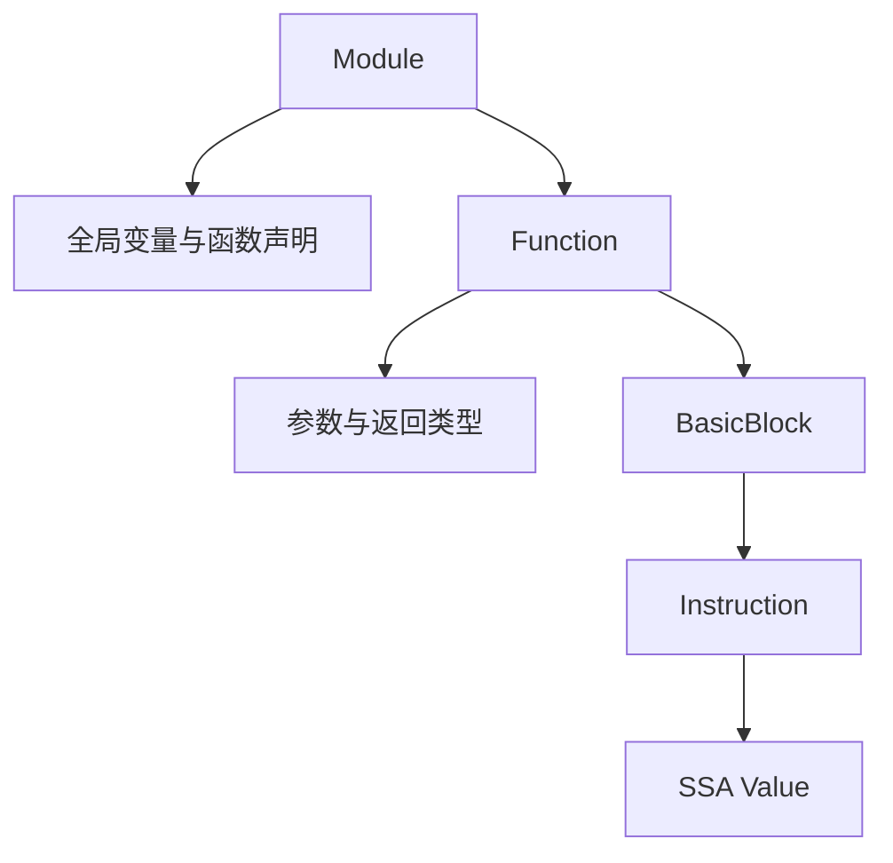
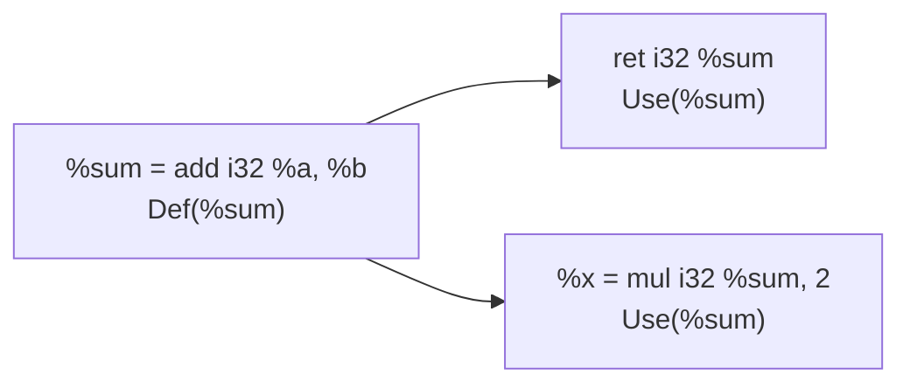
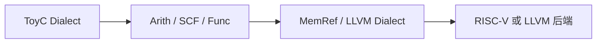

# LLVM IR 与 MLIR 参考

第三部分的 IR 设计可以使用自定义三地址码，也可以使用成熟的 LLVM IR 或 MLIR。本页用于在开始第三部分前建立共同概念。

## 一、LLVM IR 的结构

LLVM IR 通常按以下层级组织：



- **Module**：一个编译单元，包含目标三元组、数据布局、全局变量、函数定义和外部声明；
- **Function**：包含参数、返回类型和基本块；
- **BasicBlock**：只有一个入口，最后一条指令通常是分支或返回；
- **Instruction**：例如 `add`、`icmp`、`call`、`br`、`ret`、`alloca`、`load`、`store`；
- **SSA Value**：指令结果和参数，每个 SSA 名称只定义一次，控制流汇合处用 `phi` 选择值。

示例：

```llvm
define i32 @max(i32 %a, i32 %b) {
entry:
  %cond = icmp sgt i32 %a, %b
  br i1 %cond, label %left, label %right
left:
  br label %join
right:
  br label %join
join:
  %result = phi i32 [ %a, %left ], [ %b, %right ]
  ret i32 %result
}
```

这个例子把 ToyC 的 `if (a > b) return a; else return b;` 表达成条件比较、三个基本块和控制流汇合。循环也使用基本块和 `phi` 表示归纳变量。

## 二、SSA 是什么

SSA（Static Single Assignment，静态单赋值）是一种 IR 组织形式：每个 SSA 名称在一个函数中只能被定义一次，但可以被多次使用。这里的“单次赋值”针对编译器内部的值，不是说源程序变量只能赋值一次。

例如 ToyC：

```c
x = a + 1;
x = x * 2;
```

在普通变量表示中，两次赋值都写入 `x`；在 SSA 中，每次赋值产生新版本：

```llvm
%x1 = add i32 %a, 1
%x2 = mul i32 %x1, 2
```

这样每个名称的定义位置唯一，Use-Def 链可以直接从 `%x2` 找到第二条指令，再从 `%x1` 找到第一条指令。SSA 的主要目的不是改变程序语义，而是让数据流关系显式化，便于优化器判断一个值来自哪里。

### 控制流汇合与 phi

如果同一个源变量在不同控制流路径被赋予不同值，单纯改名无法决定汇合处使用哪个版本。`phi` 根据“从哪条前驱边进入”选择值：

```c
if (cond) x = 1;
else      x = 2;
return x;
```

对应的 LLVM IR 结构是：

```llvm
br i1 %cond, label %then, label %else
then:
  br label %join
else:
  br label %join
join:
  %x = phi i32 [ 1, %then ], [ 2, %else ]
  ret i32 %x
```

`phi` 不是普通运行时函数调用；它表示在控制流分析中选择前驱块产生的值，最终降低到机器代码时通常会转换成适当的寄存器移动。

### 从内存变量到 SSA

初始 lowering 可以用地址形式保持实现简单：

```llvm
%x = alloca i32
store i32 1, ptr %x
%v = load i32, ptr %x
```

这种形式允许多个 `store`，所以变量的定义关系需要通过内存分析确定。`mem2reg` 会识别适合提升的局部变量，插入必要的 `phi`，再把 `load/store` 转成 SSA 值。课程实现可以先使用 `alloca/load/store` 生成正确 IR，再将 mem2reg 作为选做优化。

### SSA 的优点和代价

- 优点：每个值只有一个定义，常量传播、复制传播、死代码消除和 Use-Def 链实现更直接；
- 优点：控制流汇合处的不同来源由 `phi` 明确表示，减少隐式的变量版本推断；
- 代价：需要维护基本块前驱关系和 `phi` 参数；
- 代价：离开 SSA 生成 RISC-V 时，需要处理 `phi` 消除、并行复制和寄存器冲突。

## 二、Use-Def 链

Use-Def 链记录 IR 中每个值的定义位置和所有使用位置，是连接 SSA、数据流分析与优化的重要关系。

- **Def（Definition）**：产生一个值的指令或函数参数。例如 `%sum = add i32 %a, %b` 定义 `%sum`；
- **Use（Use）**：读取某个值的操作数位置。例如 `ret i32 %sum` 使用 `%sum`；
- **Use-Def 链**：从一次使用反向找到它对应的定义；
- **Def-Use 链**：从一次定义正向找到该值的全部使用。



在 SSA 形式下，普通 SSA 值只有一个定义，因此 Use-Def 链可以直接通过值的定义指针定位；多个控制流来源汇合时，由 `phi` 指令定义一个新值。内存变量经过 `alloca/load/store` 表示时，一个变量可能有多个 store 定义，需要借助内存到 SSA 的转换或到达定义分析建立对应关系。

### 建议数据结构

```text
Value {
  name
  type
  definition: Instruction | Argument
  uses: List<Use>
}

Use {
  user: Instruction
  operand_index
}

Instruction {
  operands: List<Value>
  result: Value?
}
```

创建指令时，为每个操作数向被使用的 `Value.uses` 追加一条 `Use`；删除或替换指令时，必须同步移除旧 Use 并更新新值的 Use 列表。也可以使用 `def -> uses` 和 `use -> def` 两张哈希表实现同样关系。

### Use-Def 链的作用

1. **常量传播**：若 Def 是常量定义，沿所有 Use 替换为常量；
2. **死代码消除**：若一条纯计算指令的结果没有任何 Use，可以删除该指令；有函数调用、存储等副作用的指令不能仅凭无 Use 删除；
3. **公共子表达式消除**：检查已有计算结果是否仍然有效，并把新的 Use 重定向到旧 Def；
4. **活跃变量分析和寄存器分配**：根据 Use 的位置计算值的活跃区间，确定何时释放寄存器或插入 spill；
5. **验证 IR**：检查每个 Use 是否能找到合法 Def，检查 SSA 值是否违反单一定义规则。

例如：

```llvm
%t0 = add i32 %a, 1
%t1 = mul i32 %t0, 2
ret i32 %t1
```

`%t0` 的 Def 是第一条指令，Use 是第二条指令；`%t1` 的 Def 是第二条指令，Use 是 `ret`。如果 `%t1` 没有 Use，且第二条指令没有副作用，则可以执行死代码消除。

### 建立 Use-Def 链的伪代码

```text
build_use_def(function):
  for block in function.blocks:
    for instruction in block.instructions:
      if instruction.result exists:
        instruction.result.definition = instruction
      for index, operand in enumerate(instruction.operands):
        operand.uses.append(Use(instruction, index))

replace_all_uses(old_value, new_value):
  for use in copy(old_value.uses):
    use.user.operands[use.operand_index] = new_value
    new_value.uses.append(use)
  old_value.uses.clear()
```

## 三、LLVM IR 的优点与局限

优点：

- SSA、基本块和类型系统定义清晰，适合常量传播、死代码消除和控制流优化；
- 有成熟的验证器、优化器和多目标后端，可减少自研基础设施；
- 文本格式便于调试，LLVM IR 到 RISC-V 的降低路径资料丰富。

局限：

- LLVM IR 的语义和 API 较复杂，初学者需要理解 SSA、`phi`、内存模型和数据布局；
- ToyC 的高层结构会较早降低为低层操作，源码信息和高层优化机会可能丢失；
- 如果直接依赖 LLVM 工具链，构建环境和版本管理会增加课程项目的复杂度。

## 四、MLIR 的结构

MLIR 使用通用 IR 基础设施和可组合的 Dialect：



MLIR 的基本结构是 `Operation`、`Region`、`Block` 和 `Value`：一个 Operation 可以有操作数、结果、属性、多个 Region；Region 包含 Block，Block 包含 Operation。不同抽象层通过 lowering pass 转换，例如 ToyC 方言可以先保留 `toy.if` 和 `toy.call`，再降低为 `scf.if`、`func.call` 和 LLVM Dialect。

## 五、MLIR 的优点与局限

优点：

- 支持多层抽象，能够在保留高层语义的同时逐步降低到机器相关 IR；
- Dialect 和 conversion pass 适合表达自定义语言、领域操作以及不同后端；
- 与 LLVM 生态衔接良好，最终可以降低到 LLVM IR。

局限：

- 概念和工程量明显高于简单三地址码，Dialect、Trait、Type 和 Pass 都需要学习；
- 为 ToyC 编写完整 Dialect 对小型课程编译器可能过重；
- 不同 lowering 阶段的合法操作集合和转换顺序需要额外维护。

## 六、选型建议

| 方案 | 适合情况 | 必须说明 |
| --- | --- | --- |
| 自定义三地址码 | 希望专注 AST 转换、优化和后端 | 指令格式、数据结构、控制流和类型 |
| LLVM IR | 希望使用成熟 SSA 和后端 | `alloca/load/store`、`phi`、调用约定和 lowering |
| MLIR | 希望保留高层结构并展示多阶段 lowering | Dialect、Operation、Region、Block、Value 和转换 Pass |

无论选择哪一种方案，最终报告都要给出同一个 ToyC 程序在 IR 中的完整表示，并说明 IR 如何进入第四部分优化和第五部分目标代码生成。
